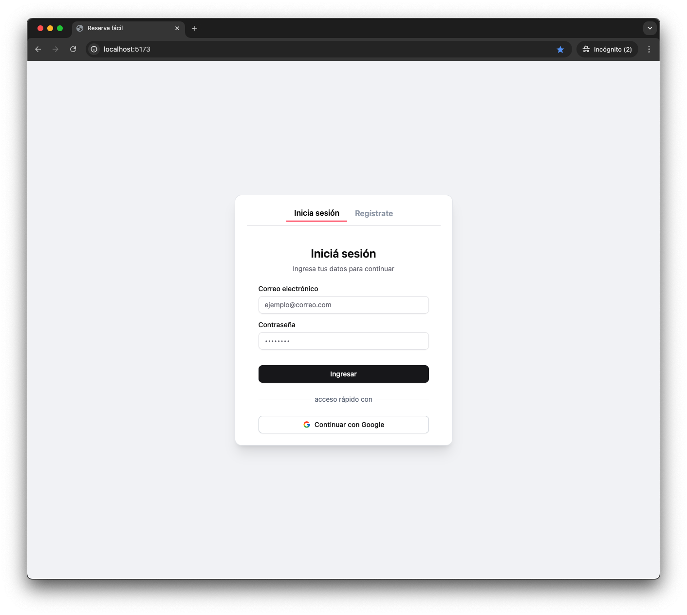
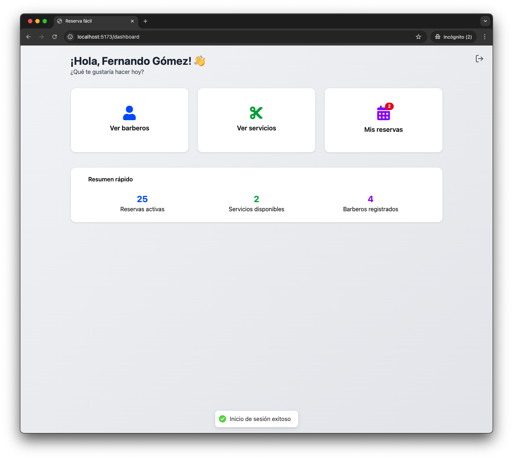
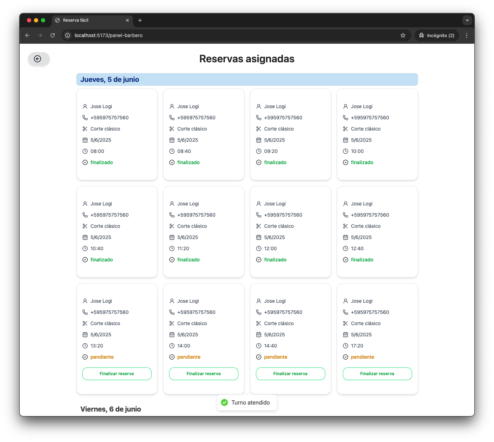
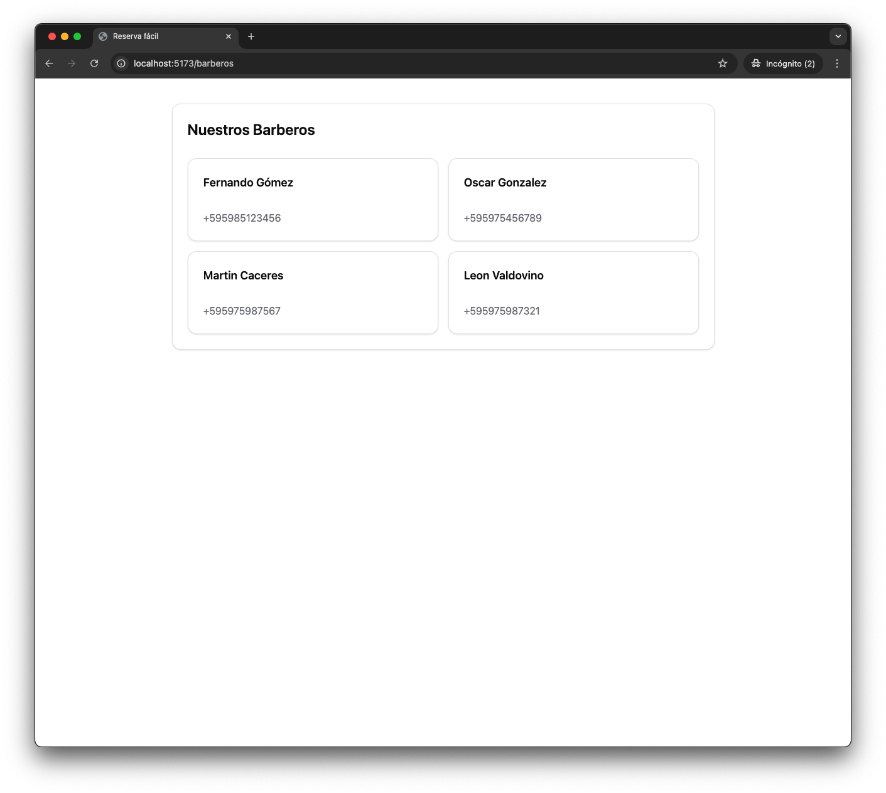
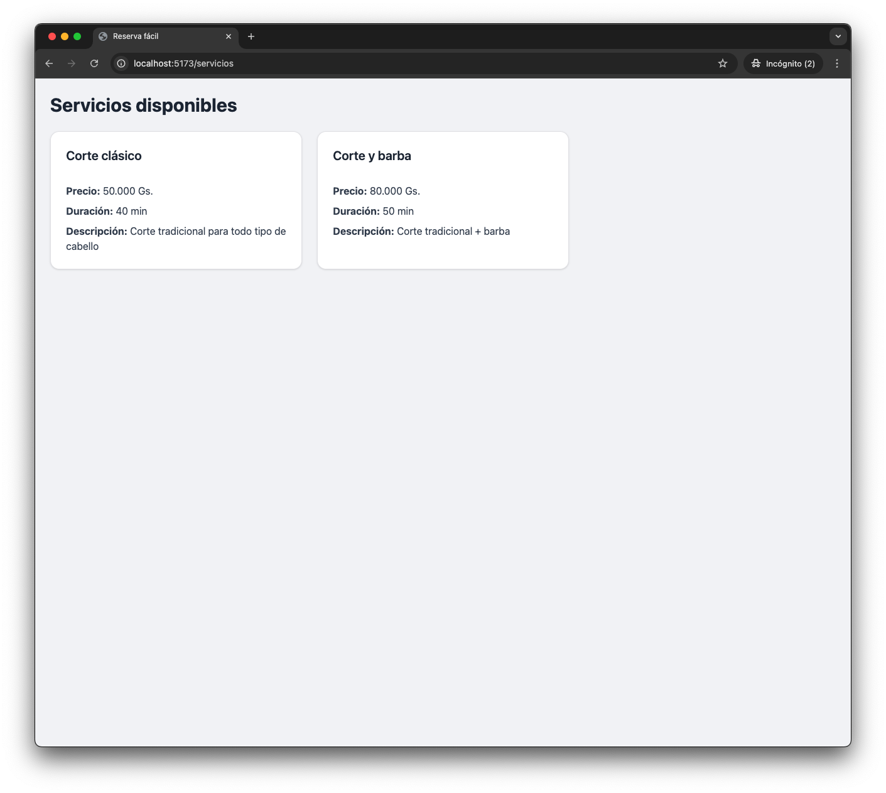
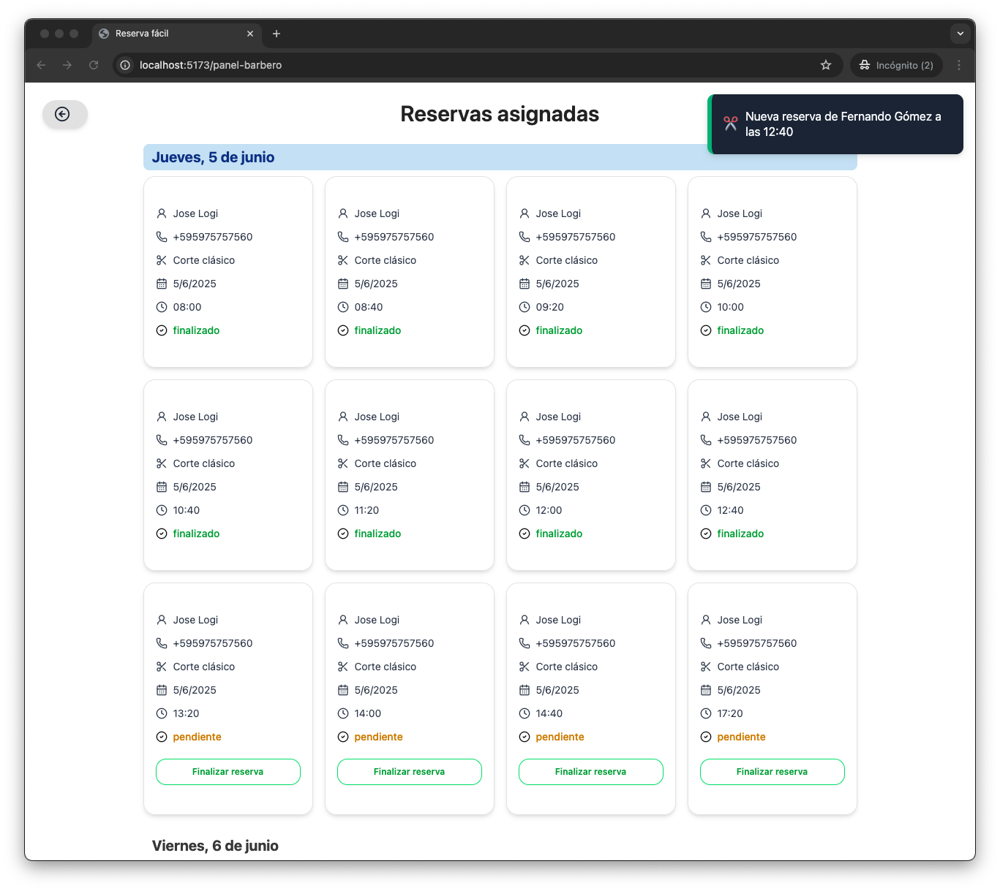
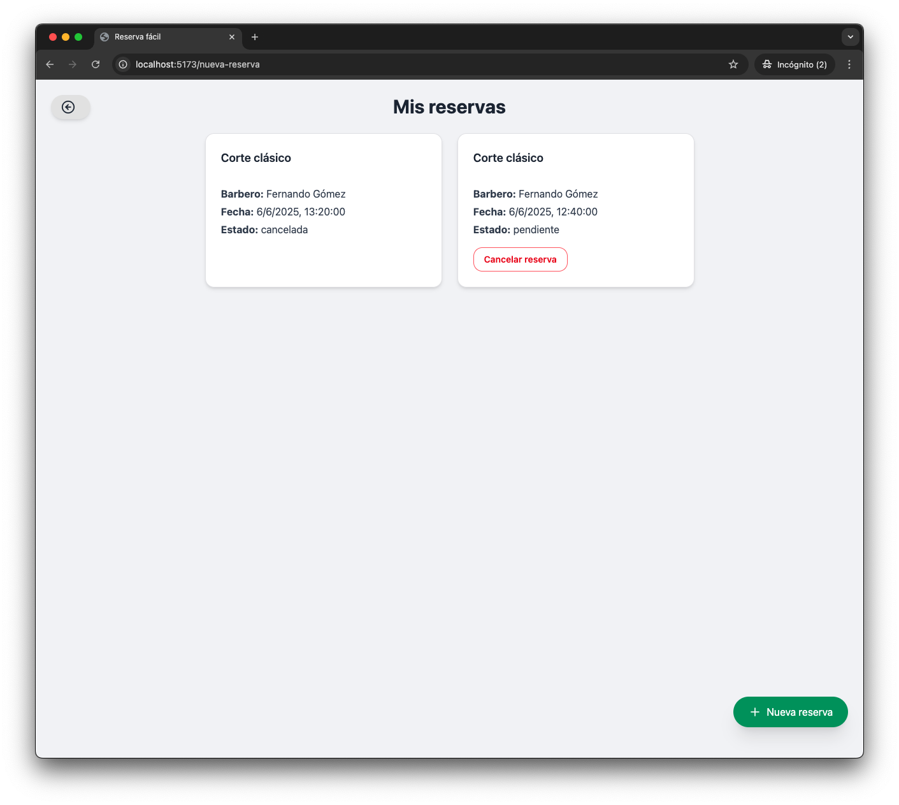
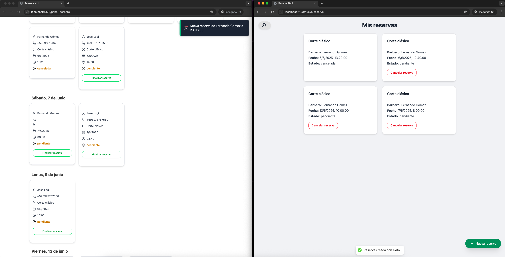

# ReservaFácil 💈

ReservaFácil es una aplicación web moderna y responsiva para la **gestión de reservas en barberías**, desarrollada con el stack **MERN** y funcionalidades en tiempo real, notificaciones por WhatsApp y una experiencia visual mejorada.

---

## Características principales

- ✅ Registro e inicio de sesión para clientes y barberos
- 📆 Reservas de turnos con validación de conflictos de horario
- 🔔 Notificaciones en tiempo real con **Socket.io**
- 📱 Recordatorios automáticos por **WhatsApp** usando **Twilio**
- 💻 Panel de administración y panel exclusivo para barberos
- 🛡️ Seguridad con autenticación por tokens y cookies

---

## 🛠️ Tecnologías utilizadas

### Frontend

- **React** con Vite
- **TailwindCSS** + **ShadCN/UI** (UI moderna y accesible)
- **Socket.io-client** para actualizaciones en tiempo real
- **React Hot Toast** para notificaciones
- **Framer Motion** para animaciones suaves

### Backend

- **Node.js** + **Express**
- **MongoDB** + **Mongoose**
- **Socket.io** (WebSockets)
- **Twilio API** (WhatsApp)
- **Node-Cron** para tareas programadas
- **Helmet** + **Compression** para optimización y seguridad

---

## 📦 Instalación local

```bash
# Clona el repositorio
git clone https://github.com/tuusuario/reservafacil.git
cd reservafacil

# Instala dependencias del servidor
cd server
npm install

# Instala dependencias del cliente
cd ../client
npm install
```

---

## ⚙️ Variables de entorno

Crea un archivo `.env` en la raíz del backend con los siguientes valores:

```env
PORT=3000
MONGO_URI=tu_conexion_mongo
JWT_SECRET=clave_secreta
TWILIO_ACCOUNT_SID=xxxxxxxxxxxxxxxxxxxxxxxxxxxxxxxx
TWILIO_AUTH_TOKEN=xxxxxxxxxxxxxxxxxxxxxxxxxxxxxxxx
TWILIO_PHONE_NUMBER=whatsapp:+14155238886
```

---

## 🔐 Autenticación

- Manejo de sesiones mediante JWT + cookies
- Protección de rutas privadas
- Diferenciación de roles (cliente, barbero, admin)

---

## 📆 Recordatorios vía WhatsApp

- Implementado con Twilio + Node-Cron
- Se envía un recordatorio 40 minutos antes del turno programado

---

## 📸 Capturas de pantalla

### 🧑‍💼 Inicio de sesión
<div align="center" style="display: flex; gap: 16px; justify-content: center;">
  
  
</div>
<div align="center" style="display: flex; gap: 16px; justify-content: center;">
  
  
</div>
<div align="center" style="display: flex; gap: 16px; justify-content: center;">
  
  
</div>
<div align="center" style="display: flex; gap: 16px; justify-content: center;">
  
  
</div>
<div align="center" style="display: flex; gap: 16px; justify-content: center;">
  

</div>


---

